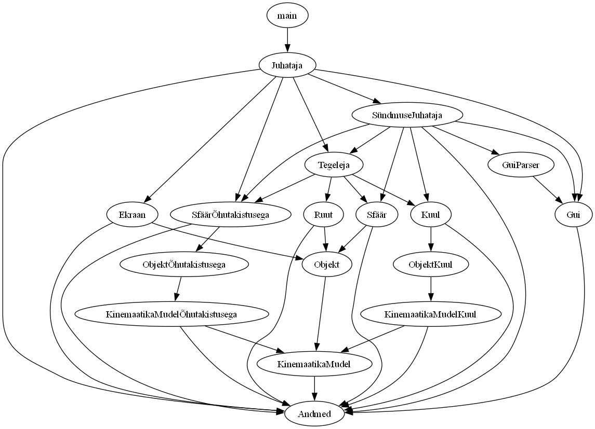
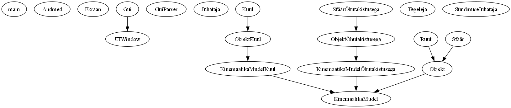

# ksk
Kinemaatika Simulatsioon ja Kalkulaator

## Impordi struktuur


## Päriluse struktuur


## Arenduskeskkonna Seadistamine

1. **Veenduge, et Python on Paigaldatud**  
    Kontrollige, et teie süsteemis on Python 3.10 või uuem versioon. Selleks saate alla laadida uusima versiooni ametlikult [Python'i veebilehelt](https://www.python.org/downloads/) või kontrollida oma paigaldust järgmise käsuga:
   
   ```python --version```

2. **Paigaldage Projekti Sõltuvused**
    Avage oma käsurida ja liikuge projekti kausta. Kui olete seal, paigaldage kõik vajalikud sõltuvused järgmise käsu abil:
    
    ```pip install -r requirements.txt```

3. **Käivitage Rakendus**
    Lõpuks, et alustada põhiprogrammi, käivitage main.py skript, kas oma IDE-ga või käsurea kaudu.

    IDE kaudu:
    Avane IDE-s ```/ksk``` kaust ja leidke ```main.py```. Siis failis olles tõenäoliselt peate vajutama mingit nuppu sildiga "Run".

    Käsurea kaudu:
    Avage oma käsurida ja liikuge projekti kausta. Kui olete seal, käivitage main.py skript käsuga:

    Windows'is
    ```python main.py```

    Linux'is
    ```python3 main.py```


NB! Et genereerida pilt selle koodibaasi impordi struktuurist, palun laadige alla [Graphviz'i](https://graphviz.org/download/) uusim versioon nende ametlikult allalaadimislehelt!